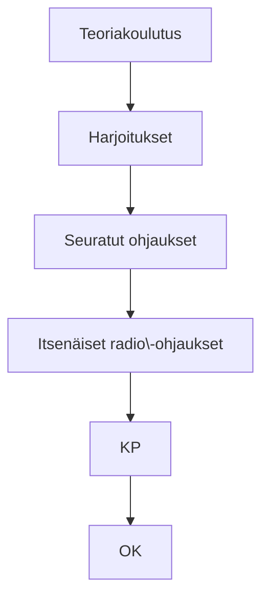

# Radiokouluttajan opas

Tämä opas on tarkoitettu opiskelumateriaaliksi radiokouluttajaoppilaalle ja yleispäteväksi ohjeeksi kaikille kouluttajille, kerhokohtaiset käytännöt huomioiden.

Oppaan julkaisuversio löytyy [Gitbook](https://www.gitbook.com/book/laskuvarjotoimikunta/radiokouluttajan_opas)ista, josta voit joko lukea opasta suoraan selaimella (tai mobiilissa) tai ladata oppaan pdf/ebook/mobi -muodoissa.

## Oppaan muokkaaminen

Opas on rakennettu [Gitbook](https://github.com/GitbookIO/gitbook)in pohjalle.

Opas ylläpidetään Githubissa siten, että se on kaikkien muokattavissa/kommentoitavissa. Varsinainen julkaisu menee tietyn moderointiprosessin kautta.

Teen nyt tähän bränchiin muokkauksen. Kokeillaan toimiiko.

Versionhallintaohjelmistona toimii siis git.

Tarvitset muokkaamiseen github-tunnuksen. Luo se [täällä](https://github.com/join).

Tekstimuoto on markdownia. Helppo opas markdown-syntaksiin löytyy [täältä](https://github.com/akx/markdown-cheatsheet-fi/blob/master/Markdown-Ohje.md). Lisää luonnollisesti googlesta etsimällä.

Kaavioiden tekemiseen käytetään Mermaid-kirjastoa. Sen syntaksia voi helposti testata [täällä](http://knsv.github.io/mermaid/live_editor/).

### Muokkaaminen Githubissa

Tekstiä voi muokata suoraan Githubissa etsimällä ensin oikea tiedosto ja sen jälkeen Edit-painikkeen kautta tehdä haluamansa muutokset.

Tämän jälkeen "lähetä" muutokset eteenpäin painamalla "Propose changes". Tämä tekee muutoksistasi oman haaran, johon voit tehdä useita muutoksia.

Kun olet valmis muokkauksiesi kanssa, lähetä "moderaattoreille" pyyntö ottaa tekemäsi muutokset (haara) mukaan julkaisuversioon tekemällä 'Pull Request'.

